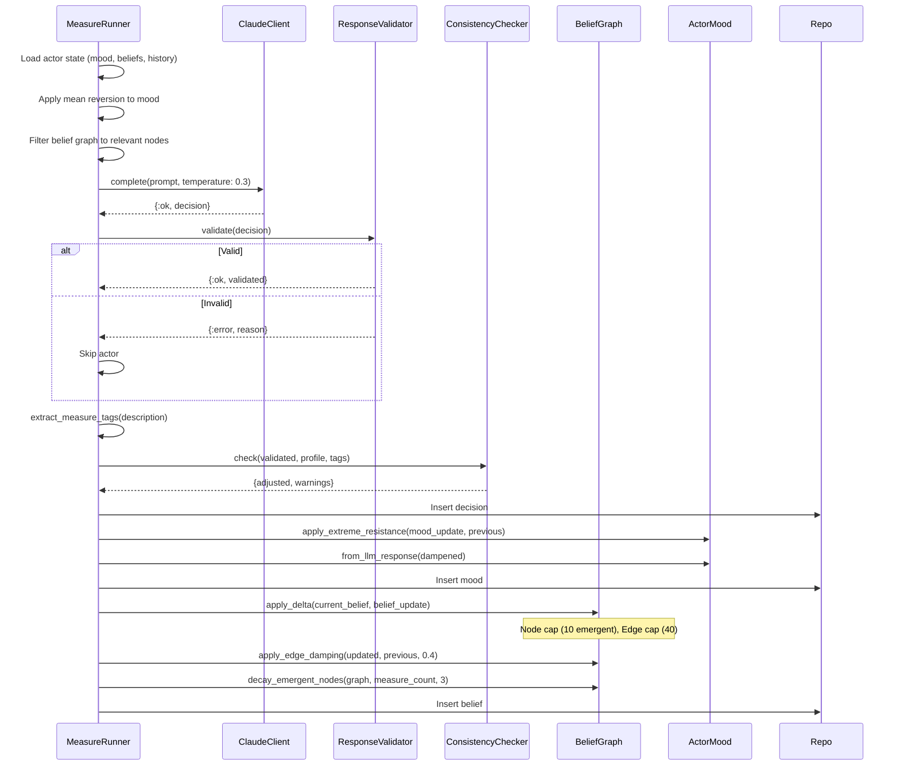

# LLM Grounding Controls

## Context

The population simulator uses Claude Haiku as the decision engine for each simulated actor. While the **input grounding** (EPH microdata, demographic profiles, belief templates) is solid, the **emergent dynamics** can hallucinate sociological patterns that aren't supported by the data. The LLM can "invent sociology" — generating causal relationships, mood trajectories, and emergent concepts that reflect model biases rather than plausible actor behavior.

This is a fundamental tension: the LLM needs creative latitude to produce varied, realistic responses, but without constraints it will fabricate patterns (e.g., all actors converging to the same opinion, inventing abstract concepts like `neoliberal_awakening`, or showing implausible mood shifts for a given demographic).

## Business Rules

### Rule Constraints (Layer 1 — Pre-persistence validation)

- **ResponseValidator** runs before any data hits the database.
- Agreement must be boolean. Intensity clamped to 1-10.
- Text fields truncated: reasoning/personal_impact/behavior_change at 500 chars, mood narrative at 300 chars.
- Belief delta limits per measure: max 3 new emergent nodes, max 5 new edges, max 5 modified edges.
- Emergent node IDs must be snake_case, max 30 characters (regex: `^[a-z][a-z0-9_]{0,29}$`).
- Mood values clamped to 1-10 (redundant with ActorMood, but catches it earlier).
- Temperature set to 0.3 (balances variety vs. determinism).
- Invalid responses return `{:error, reason}` and the actor is skipped for that measure.

### Bounded Belief Updates (Layer 2 — Graph growth control)

- **Max emergent nodes**: 10 per actor graph (15 core are fixed). Once at cap, new emergent nodes are silently dropped.
- **Max total edges**: 40 per actor graph. Excess new edges are silently dropped.
- **Edge weight damping**: Weight changes capped at 0.4 per measure. A weight at 0.3 cannot jump to 0.9 in one step — max it reaches is 0.7.
- **Emergent node decay**: If an emergent node's `last_reinforced` is more than 3 measures behind `current_measure_index`, the node and all its edges are removed. This prevents the graph from accumulating stale concepts that the LLM invented once and never revisited.

### Consistency Checks (Layer 4 — Demographic grounding)

- **ConsistencyChecker** runs after validation, before persistence.
- **Stratum-mood rule**: Destitute/low stratum actors facing austerity/cut measures → `economic_confidence` capped at 6, `social_anger` floored at 3.
- **Orientation-intensity rule**: Left-leaning actors (orientation ≤ 3) strongly agreeing (intensity ≥ 9) with liberal/deregulation measures → intensity capped at 7. Same for right-leaning (≥ 8) with statist measures.
- Returns `{adjusted_response, warnings}`. Warnings are logged to stdout during simulation.
- Does NOT reject responses — only adjusts implausible values.

### Calibration Loops (Layer 3 — Variance measurement)

- `mix sim.calibrate --measure-id <id> --runs N --sample M` runs the same prompt N times per actor for M sampled actors.
- Does NOT persist any results.
- Reports: agreement consistency (% of runs where actor gave majority answer), intensity mean/std, per-mood-dimension mean/std.
- Flags: intensity std > 2.0 (high variance), agreement consistency < 70% (random flipping).
- Use case: run after adjusting temperature, prompt instructions, or validation rules to verify the LLM produces consistent responses from the same input.

### Variance Analysis (Layer 5 — Post-hoc pattern detection)

- `mix sim.variance --population "Panel"` analyzes persisted simulation results.
- **Consensus detection**: Flags measures with >90% or <10% approval rate, or intensity variance < 1.5.
- **Emergent node bias**: Flags emergent concepts appearing in >50% of actors (model bias — the LLM is injecting the same concept into everyone).
- **Mood clustering**: Flags measures where 2+ mood dimensions have variance < 1.0 across actors (everyone is being pushed to the same mood).
- **Belief homogenization**: Flags edge weights with variance < 0.01 across actors (belief graphs are converging to identical structures).

## Domain Events

```
MeasureAnnounced → (per actor)
  → LLMResponseReceived
  → ResponseValidated | ResponseRejected
  → ConsistencyChecked (with optional warnings)
  → MoodUpdated (with extreme resistance + mean reversion)
  → BeliefGraphUpdated (with delta bounds + edge damping + emergent decay)
  → DecisionPersisted
```

## Sequence Diagram



## API Contracts

### ResponseValidator.validate/1

```elixir
@spec validate(map()) :: {:ok, map()} | {:error, String.t()}
```

Input: Raw parsed LLM response map with keys `:agreement`, `:intensity`, `:reasoning`, `:personal_impact`, `:behavior_change`, `:mood_update`, `:belief_update`, `:tokens_used`, `:raw_response`.

Output: Same structure with clamped/truncated/filtered values, or error if structurally invalid (non-boolean agreement).

### ConsistencyChecker.check/3

```elixir
@spec check(map(), map(), list(String.t())) :: {map(), list(String.t())}
```

Input: Validated response, actor profile (string-key map), measure tags (e.g., `["cut", "austerity"]`).

Output: `{adjusted_response, warnings}` where warnings is a list of human-readable strings.

### BeliefGraph — New public functions

```elixir
@spec apply_edge_damping(map(), map(), float()) :: map()
@spec decay_emergent_nodes(map(), integer(), integer()) :: map()
```

## Constraints

- All controls are **synchronous** and run in the actor evaluation flow. No async post-processing.
- ConsistencyChecker adjusts but never rejects. Only ResponseValidator can reject.
- Measure tags are extracted from Spanish text via keyword matching — this is heuristic, not NLP.
- Emergent node decay requires the `last_reinforced` field on nodes, which must be set by the LLM or the system. Currently relies on `last_reinforced` defaulting to 0 if absent.
- Calibration runs make real API calls — they cost tokens. Use small samples.

## Tradeoffs and Rejected Alternatives

| Decision | Alternative | Why rejected |
|----------|------------|--------------|
| Soft clamping (adjust values) | Hard rejection (reject entire response) | Losing entire actor responses wastes API calls and creates gaps in the dataset |
| Temperature 0.3 | Temperature 0.0 | Zero temperature makes identical profiles give identical responses, destroying demographic variance |
| Max 0.4 edge weight change/measure | No damping | Without damping, a single measure can flip a causal relationship from -1.0 to +1.0, which is sociologically implausible |
| Keyword-based measure tags | LLM-based measure classification | Adding another LLM call per measure evaluation increases cost and latency; keywords are sufficient for coarse demographic rules |
| Emergent decay after 3 measures | No decay / aggressive decay (1 measure) | 3 measures gives concepts time to be reinforced if genuinely relevant, while cleaning up one-off hallucinations |
| Node cap at 10 emergent | No cap / lower cap (5) | 10 allows meaningful concept evolution while preventing unbounded graph growth |

## Open Questions

1. **Measure tag accuracy**: Keyword extraction from Spanish text is fragile. Some measures may not match any tags, bypassing consistency checks. Consider a small LLM call to classify measures into tags (cost: ~50 tokens per measure, one-time).
2. **Emergent node `last_reinforced`**: The LLM doesn't currently set this field on returned nodes. The system should update it when an emergent node appears in a belief delta's modified/new edges. This tracking is not yet implemented.
3. **ConsistencyChecker rules coverage**: Only 2 rules implemented (stratum-mood, orientation-intensity). Additional rules to consider:
   - Employment type + wage measure → expected mood direction
   - Age + pension measure → expected intensity range
   - Housing tenure + rent measure → personal_impact relevance
4. **Variance thresholds**: The current thresholds (intensity std > 2.0, agreement < 70%, emergence > 50%) are educated guesses. They should be calibrated against actual simulation runs.
5. **Cross-actor belief contamination**: Even with per-actor controls, the LLM may produce similar emergent concepts across actors because it's the same model. The variance analysis detects this but doesn't prevent it. A possible mitigation: include a random seed or actor-specific instruction to encourage divergent reasoning.
