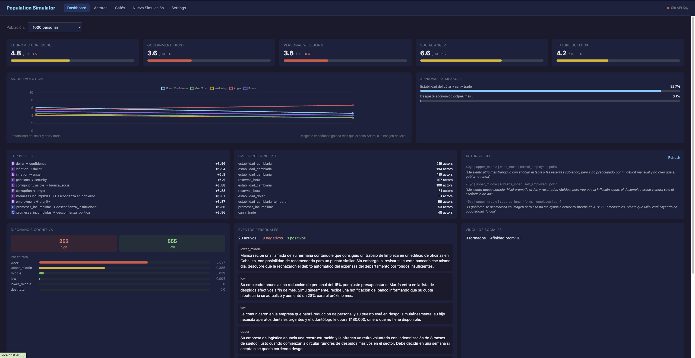
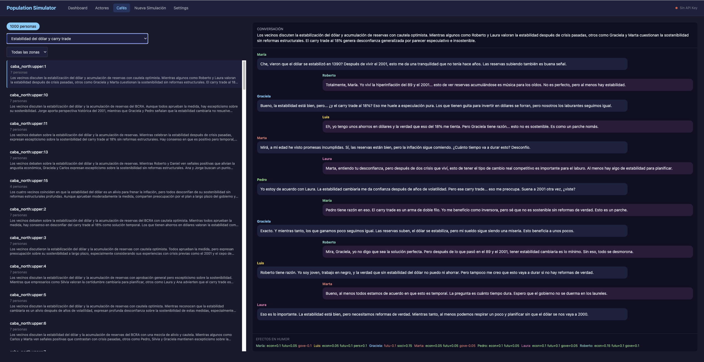

# Simulador de Población

Aplicación Elixir/OTP que simula cómo reacciona la población del Gran Buenos Aires (GBA) ante medidas económicas, usando microdatos reales del INDEC EPH y la API de Claude como motor de decisión para cada actor.

Los actores tienen **memoria**, **estado de ánimo**, un **grafo de creencias** y **conciencia** — acumulan experiencias a lo largo de las medidas, cambian de opinión, desarrollan conceptos emergentes, conversan con vecinos, forman vínculos sociales, y construyen relatos autobiográficos que evolucionan con el tiempo.





## Cómo funciona

1. **Pipeline de datos**: Carga microdatos de la EPH (Encuesta Permanente de Hogares) del INDEC para GBA (CABA + Conurbano), realiza muestreo ponderado por PONDERA, y enriquece cada actor con variables sintéticas financieras, actitudinales y de memoria de crisis calibradas con fuentes del BCRA, UTDT y Latinobarómetro. Imputa ingresos para hogares con no-respuesta (DECCFR=12) usando medianas por decil.

2. **Estratificación**: Los actores se clasifican en 6 estratos usando metodología INDEC — ingreso del hogar por adulto equivalente vs umbrales CBT/CBA derivados de la estratificación socioeconómica real del INDEC. Un factor de ajuste basado en el RIPTE cierra la brecha temporal entre los datos de la EPH y los precios actuales. Calibrado contra los targets del INDEC 2do semestre 2025: 6.3% indigencia, 28.2% pobreza.

3. **Poblaciones**: Grupos fijos de actores con nombre. Se crea una población, se asignan actores, y se corren múltiples medidas contra el mismo grupo para seguir la evolución en el tiempo.

4. **Sistema de ánimo**: Cada actor tiene 5 dimensiones de humor (confianza económica, confianza en el gobierno, bienestar personal, enojo social, perspectiva de futuro) que evolucionan con cada medida. El LLM ve el humor actual del actor y lo actualiza según cómo le afecta la medida.

5. **Grafo de creencias**: Cada actor tiene un grafo dirigido que representa su modelo mental — los nodos son conceptos (inflación, empleo, impuestos, etc.) y las aristas son relaciones causales o emocionales con pesos. El grafo evoluciona con cada medida: las aristas se fortalecen/debilitan y pueden aparecer nuevos nodos "emergentes" cuando el LLM identifica conceptos nuevos.

6. **Evaluación LLM**: Cuando se anuncia una medida, cada actor recibe un prompt en primera persona construido desde su perfil, humor, creencias, historia y conciencia. Responde con una decisión JSON estructurada (acuerdo, intensidad, razonamiento, impacto personal, cambio de comportamiento, actualización de humor, actualización de creencias).

7. **Conciencia** (8 capas):
   - **Mesa de café**: Después de cada medida, los actores se agrupan en mesas de 5-7 por zona + estrato. Una llamada LLM por mesa genera una conversación grupal completa en español rioplatense. La conversación influye en el humor y creencias de cada participante. Los diálogos completos se persisten.
   - **Memoria autobiográfica**: Un relato evolutivo de ~200 palabras por actor que describe quién es y qué experimentó. Se actualiza en las rondas de introspección.
   - **Metacognición**: Cada 3 medidas, cada actor reflexiona sobre sus decisiones recientes y conversaciones, actualiza su narrativa e identifica patrones en su propio comportamiento (auto-observaciones).
   - **Disonancia cognitiva**: Índice 0-1 que mide la contradicción entre el humor/creencias/historia del actor y sus decisiones. Alta disonancia sube la temperatura del LLM (más volatilidad). La disonancia acumulada no resuelta se convierte en enojo social. En la introspección, el actor confronta sus contradicciones.
   - **Eventos personales**: ~20% de los actores recibe un evento de vida generado por LLM después de cada medida (derivado de la medida o de su vida personal). Los eventos modifican humor y perfil (empleo, ingreso, etc.) y decaen en 1-6 medidas.
   - **Vínculos sociales**: Los actores que comparten 3+ cafés forman vínculos persistentes. Las mesas de café priorizan sentar juntos a actores vinculados. Los vínculos decaen sin refuerzo.
   - **Teoría de la mente**: Después de cada café, los actores perciben el ánimo de su grupo e identifican 1-2 referentes que los influenciaron. Estas percepciones se inyectan en prompts futuros.
   - **Intenciones**: Durante la introspección, los actores generan intenciones libres ("voy a buscar trabajo", "voy a comprar dólares"). El LLM las resuelve en la siguiente introspección. Los efectos se aplican al perfil del actor.

8. **Métricas**: Agregación SQL computa tasas de aprobación segmentadas por estrato, zona, tipo de empleo y orientación política. La evolución del humor y creencias se trackea en el tiempo por población.

## Requisitos

- Elixir 1.19+
- API key de Anthropic

## Instalación

```bash
# Instalar dependencias y configurar base de datos
mix deps.get
mix ecto.create
mix ecto.migrate

# Descargar datos EPH del INDEC (T3 2025)
./scripts/download_eph.sh 3 2025

# Generar templates de grafos de creencias (8 llamadas LLM)
export CLAUDE_API_KEY=sk-ant-...
mix sim.beliefs.init

# Crear 1000 actores con una población nombrada
mix sim.seed --n 1000 --population "1000 personas"
```

## Correr simulaciones

### Medida básica (sin conciencia)

```bash
export CLAUDE_API_KEY=sk-ant-...

mix sim.run \
  --title "Eliminación de subsidios" \
  --description "El gobierno eliminó los subsidios a las tarifas de luz, gas y agua." \
  --population "1000 personas"
```

### Medida + conversaciones de café

```bash
# Una medida con ronda de café (~1350 llamadas LLM)
./scripts/run_measure_with_cafe.sh \
  "El gobierno eliminó los subsidios a las tarifas de luz, gas y agua." \
  --title "Eliminación de subsidios" \
  --population "1000 personas"

# O directamente con mix:
mix sim.run \
  --title "Eliminación de subsidios" \
  --description "El gobierno eliminó los subsidios a las tarifas de luz, gas y agua." \
  --population "1000 personas" \
  --cafe
```

### Ciclo completo de conciencia (3 medidas)

Corre 3 medidas con conversaciones de café. La 3ra dispara introspección automática:

```bash
# Interactivo — pregunta cada medida
./scripts/run_full_cycle.sh "1000 personas"

# Desde un archivo TSV (tab-separado: título\tdescripción)
MEASURES_FILE=escenarios.tsv ./scripts/run_full_cycle.sh "1000 personas"
```

Ejemplo `escenarios.tsv`:
```
Estabilidad del dólar	El dólar se estabiliza en $1390, carry trade rinde 18%, BCRA acumula reservas.
Suba de tarifas	El gobierno anuncia suba del 15% en tarifas de luz, gas y agua.
Aumento jubilaciones	Se aprueba aumento del 12% en jubilaciones y pensiones.
```

### Introspección manual

```bash
./scripts/run_introspection.sh "1000 personas"
```

## Consultar resultados

### Humor y creencias

```bash
mix sim.mood --population "1000 personas"
mix sim.mood --population "1000 personas" --history
mix sim.beliefs --population "1000 personas"
mix sim.beliefs --population "1000 personas" --emergent
mix sim.beliefs --population "1000 personas" --edge "taxes->employment" --history
```

### Conversaciones de café

```bash
# Resumen estadístico
./scripts/query_cafes.sh --stats

# Todas las conversaciones de una zona
./scripts/query_cafes.sh --zone suburbs_outer

# Historial de cafés de un actor
./scripts/query_cafes.sh --actor-id <uuid>

# O con mix directamente:
mix sim.cafe --measure-id <id>
mix sim.cafe --measure-id <id> --zone suburbs_outer
mix sim.cafe --actor-id <id>
```

### Narrativas de introspección

```bash
# Resumen de la población
./scripts/query_introspection.sh

# Historial narrativo de un actor
./scripts/query_introspection.sh --actor-id <uuid>

# Muestra aleatoria de narrativas
./scripts/query_introspection.sh --sample 5

# O con mix:
mix sim.introspect --actor-id <id>
mix sim.introspect --population "1000 personas"
```

### Resetear

```bash
# Limpiar datos de simulación (mantiene actores + estado inicial)
./scripts/clean_simulation.sh

# Reset completo (borra todo)
./scripts/clean_simulation.sh --full
```

## Gestión de poblaciones

```bash
mix sim.population.create --name "Panel A" --description "Grupo de prueba"
mix sim.population.assign --name "Panel A" --zone caba_north,caba_south --age-max 35 --limit 100
mix sim.population.list
mix sim.population.info --name "Panel A"
```

## Calibración y varianza

```bash
# Correr la misma medida N veces sin persistir — verificar consistencia del LLM
mix sim.calibrate --measure-id <id> --runs 5 --sample 10

# Analizar resultados persistidos en busca de consenso artificial o sesgo
mix sim.variance --population "1000 personas"
```

## Ciclo de simulación

```
=== MEDIDA N ===
MeasureRunner       → 1000 decisiones individuales (perfil + humor + creencias + conciencia)
DissonanceCalc      → índice de disonancia por actor (ajusta temperatura LLM)
EventGenerator      → ~200 eventos personales para actores vulnerables
CafeRunner          → ~150 conversaciones grupales (5-7 actores por mesa)
AffinityTracker     → actualiza vínculos entre pares
TheoryOfMindBuilder → percepciones grupales + referentes

=== MEDIDA N+1 ===
(mismo flujo, ahora con vínculos, eventos activos y percepciones en los prompts)

=== MEDIDA N+2 ===
(mismo flujo)
IntrospectionRunner → 1000 reflexiones → narrativas + intenciones
IntentionExecutor   → ejecuta intenciones resueltas → actualiza perfiles

(el ciclo se repite cada 3 medidas)
```

**Costo por medida**: ~1350 llamadas LLM (1000 decisiones + ~200 eventos + ~150 cafés).
**Costo por ciclo de 3 medidas**: ~5050 llamadas (4050 + 1000 introspecciones).

## Controles de grounding del LLM (5 capas)

1. **Restricciones de reglas**: `ResponseValidator` aplica validación de schema (tipos, rangos, longitudes), limita intensidad 1-10, limita deltas de creencias. Temperatura 0.3.
2. **Actualizaciones de creencias acotadas**: `BeliefGraph` limita nodos emergentes a 10, aristas totales a 40, amortigua cambios de peso (max 0.4/medida), decae nodos emergentes no reforzados después de 3 medidas.
3. **Loops de calibración**: `mix sim.calibrate` corre la misma medida N veces sin persistir — alta varianza = LLM alucinando.
4. **Checks de consistencia**: `ConsistencyChecker` aplica reglas demográficas post-respuesta.
5. **Análisis de varianza**: `mix sim.variance` detecta consenso artificial, sesgo emergente, clustering de humor.

Restricciones específicas de café: deltas de humor +-1.0, max 2 aristas de creencia por actor por café, sin nodos nuevos.

## Fuentes de datos

| Fuente | Descripción |
|--------|-------------|
| [INDEC EPH](https://www.indec.gob.ar) | Microdatos de la Encuesta Permanente de Hogares (individual + hogar) |
| [INDEC CBT/CBA](https://www.indec.gob.ar/indec/web/Nivel4-Tema-4-43-149) | Canasta Básica Total/Alimentaria — líneas de pobreza/indigencia |
| [RIPTE](https://www.argentina.gob.ar/trabajo/seguridadsocial/ripte) | Índice salarial para ajuste temporal de ingresos |
| [BCRA](https://www.bcra.gob.ar) | Informe de inclusión financiera — tasas de bancarización y dolarización |
| [UTDT](https://www.utdt.edu) | Índice de confianza en el gobierno por nivel socioeconómico |
| [Latinobarómetro](https://www.latinobarometro.org) | Variables actitudinales para Argentina |

## Variables de entorno

| Variable | Requerida | Default | Descripción |
|----------|-----------|---------|-------------|
| `CLAUDE_API_KEY` | Sí | - | API key de Anthropic |
| `CLAUDE_MODEL` | No | `claude-haiku-4-5-20251001` | Modelo para llamadas LLM |
| `LLM_CONCURRENCY` | No | `30` | Llamadas API concurrentes máximas |
| `MEASURES_FILE` | No | - | Archivo TSV para `run_full_cycle.sh` |

## Licencia

Copyright 2026 Emiliano Arango. Licenciado bajo la [Apache License 2.0](LICENSE).
